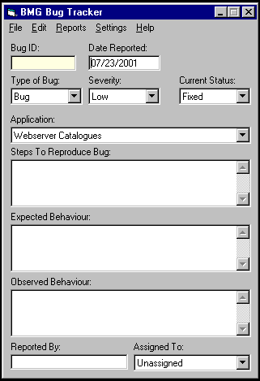



## BMGBugTracker

### Description

Due to the recent interest in providing Bug Tracking software, I have decided to submit this application (with source!) to assist developers in the software development process.
 
### More Info
 
User Entered Data

HTML/Printed Output/Data Stored in A97 DB

             |
---                |---
**Submitted On**   |2001-07-23 11:39:26
**By**             |[M H](https://github.com/Planet-Source-Code/PSCIndex/blob/master/ByAuthor/m-h.md)
**Level**          |Intermediate
**User Rating**    |4.8 (43 globes from 9 users)
**Compatibility**  |VB 6\.0
**Category**       |[Complete Applications](https://github.com/Planet-Source-Code/PSCIndex/blob/master/ByCategory/complete-applications__1-27.md)
**World**          |[Visual Basic](https://github.com/Planet-Source-Code/PSCIndex/blob/master/ByWorld/visual-basic.md)
**Archive File**   |[BMGBugTrac233137232001\.zip](https://github.com/Planet-Source-Code/m-h-bmgbugtracker__1-25361/archive/master.zip)

